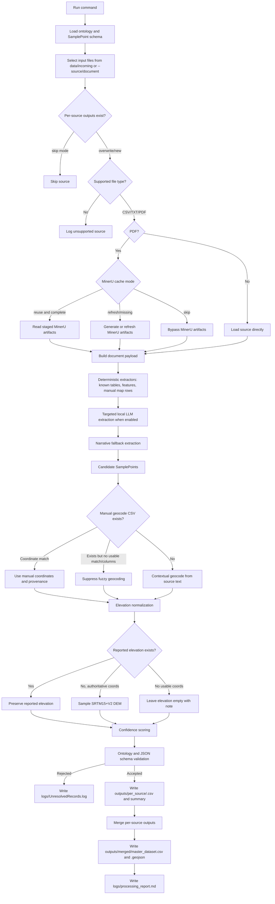

# LITTORAL (Literature-Inferred Terrestrial and Oceanic Relative Altimetry Levels)

LITTORAL is a reproducible extraction pipeline for converting coastal, shelf, and relative sea-level literature into structured geospatial evidence records. The system is designed for scientific synthesis work where useful observations are distributed across narrative text, tables, maps, figures, captions, and OCR-derived page content.

## Scientific Scope

LITTORAL targets observations that constrain past coastal position, relative sea level, shelf exposure, inundation, and associated geomorphic or sedimentary indicators. Candidate records may include submerged shoreline deposits, marine terraces, beach ridges, reef features, wave-cut platforms, estuarine or lagoonal facies, depth-constrained geomorphic surfaces, and mapped coastal landforms.

The pipeline emphasizes provenance and uncertainty. It distinguishes reported observations from derived values, preserves source locators and quotations, records coordinate provenance, and treats geocoded coordinates as approximate unless the source provides precise coordinates.

## Methodological Overview

1. **Document staging**
   Source documents are placed in `data/incoming/`. PDFs are parsed preferentially from MinerU staged artifacts in `data/staged/<source>/hybrid_auto/`.

2. **MinerU cache reuse**
   Existing MinerU outputs are reused when the expected Markdown, content-list JSON, and middle JSON artifacts are present. MinerU is run only for missing or incomplete staged artifacts.

3. **Structured extraction**
   The loader combines MinerU Markdown, structured table and figure metadata, native PDF text, OCR fallback text, and page-level OCR blocks where needed.

4. **Targeted inference**
   Deterministic extractors mine known table and feature patterns. Optional local Ollama models interpret high-value MinerU table, map, figure, and chart contexts when deterministic parsing is insufficient.

5. **Manual geocode precedence**
   When `data/manual_geocodes/<source>.csv` exists, LITTORAL treats it as the spatial authority for that source. Matching manual coordinates override contextual geocoding. If a manual table exists but lacks usable latitude/longitude columns or no row matches a candidate record, fuzzy gazetteer geocoding is suppressed rather than substituted.

6. **Contextual geocoding**
   When exact source coordinates and manual geocodes are absent, LITTORAL attempts contextual geocoding from the paper title, locality names, captions, table rows, and nearby descriptive text. These coordinates are written with inferred coordinate provenance and should be interpreted as approximate locality anchors.

7. **Validation and merge**
   Candidate records are validated against the controlled vocabulary and schema before per-source outputs are merged into master CSV and GeoJSON products.

8. **Elevation context**
   Raster-backed elevation normalization uses the local DEM at `data/elevation/SRTM15+V2.tiff` by default. Override this path with `--raster-path` when running against another DEM. DEM sampling is applied only when coordinates are reported or manually/authoritatively geocoded and the source does not report a precise elevation.

## Pipeline Process Map



At a record level, the spatial decision order is:

1. Use coordinates explicitly reported in the source record.
2. Use matching coordinates from `data/manual_geocodes/<source>.csv`.
3. If a manual geocode CSV exists but cannot provide coordinates for the record, leave coordinates empty and record the suppression note.
4. Only when no manual geocode CSV exists, infer approximate coordinates from contextual place-name geocoding.

Elevation normalization follows the same conservative pattern: reported elevations are preserved; DEM values are derived only for reported/manual authoritative coordinates; approximate contextual geocodes are not used for DEM-derived elevations.

## Data Products

- `outputs/per_source/<source>.summary.md`: source-level extraction report.
- `outputs/per_source/<source>.csv`: validated records for one source.
- `outputs/merged/master_dataset.csv`: merged tabular dataset.
- `outputs/merged/master_dataset.geojson`: merged geospatial dataset.
- `logs/UnresolvedRecords.log`: unsupported files, rejected records, and unresolved extraction cases.
- `logs/processing_report.md`: run-level processing report.

## Configuration

Primary configuration files:

- `config/extraction.json`: MinerU, PDF/OCR, Ollama, and geocoding settings.
- `config/categories.json`: controlled vocabulary for record classes, coordinate sources, depth sources, indicators, and measurement semantics.
- `config/schema.samplepoint.json`: canonical SamplePoint validation schema.

Default local data paths:

- `data/incoming/`: source PDFs and other input documents.
- `data/staged/`: reusable MinerU staged artifacts.
- `data/elevation/SRTM15+V2.tiff`: default DEM used by elevation normalization. Large raster files are local runtime assets and are not tracked by git.

Important settings:

- `mineru.skip_existing`: reuse staged MinerU artifacts when complete.
- `mineru_inference.llm_enabled`: enable targeted local LLM interpretation of MinerU contexts.
- `mineru_inference.max_llm_contexts`: cap expensive targeted LLM calls per document.
- `ollama.model`: local Ollama model used for reasoning.
- `geocoding.max_contextual_queries`: cap gazetteer attempts for inferred coordinates.
- `geocoding.min_delay_seconds`: rate-limit public gazetteer requests.

## Local Ollama Inference

LITTORAL can use local Ollama models for targeted reasoning over MinerU tables, maps, figures, and OCR-derived page contexts. This stage is intentionally optional: deterministic extraction and validation still run when Ollama is disabled, but local models improve recovery of evidence buried in complex layouts.

### Install Ollama

Ollama runs on macOS, Linux, and Windows and serves its local API at `http://localhost:11434`.

macOS:

```bash
curl -fsSL https://ollama.com/install.sh | sh
```

Linux:

```bash
curl -fsSL https://ollama.com/install.sh | sh
ollama serve
```

Windows PowerShell:

```powershell
irm https://ollama.com/install.ps1 | iex
```

Verify the installation:

```bash
ollama --version
curl http://localhost:11434/api/tags
```

Official installation references:

- macOS: <https://docs.ollama.com/macos>
- Linux: <https://docs.ollama.com/linux>
- Windows: <https://docs.ollama.com/windows>
- Quickstart and API: <https://docs.ollama.com/quickstart>

### Recommended Models

Use separate models for text reasoning and visual/OCR-heavy page interpretation when possible.

| Purpose | Recommended model | Use when | Notes |
| --- | --- | --- | --- |
| Default text reasoning | `mistral-small:24b` or `mistral-small:latest` | You want strong local extraction over MinerU Markdown, tables, and captions on a workstation with enough memory. | Good general reasoning model for JSON-style extraction prompts. |
| Lightweight text reasoning | `qwen3:8b` or another compact Qwen/Gemma-class instruct model | You need faster iteration on CPU or lower-memory machines. | Lower cost, but expect weaker table synthesis and more missed records. |
| Vision and document understanding | `qwen2.5vl:7b` | You want richer interpretation of page images, maps, charts, and figure labels. | Requires Ollama 0.7.0 or newer. Strong fit for structured visual/document extraction. |
| Vision fallback | `llama3.2-vision:11b` | Qwen2.5-VL is unavailable or performs poorly on a given page type. | Useful general image reasoning model with 128K context variants. |
| Existing local default | `glm-4.7-flash:latest` | You already have this model installed and want continuity with the checked-in configuration. | This is the current `config/extraction.json` default; Ollama's model page notes that it requires a newer pre-release Ollama build. |

Pull the default recommended text and vision models:

```bash
ollama pull mistral-small:24b
ollama pull qwen2.5vl:7b
```

Alternative pulls:

```bash
ollama pull llama3.2-vision:11b
ollama pull qwen3:8b
ollama pull glm-4.7-flash:latest
```

Inspect installed models:

```bash
ollama list
```

Before changing a production run, test a model interactively:

```bash
ollama run mistral-small:24b
```

### Configure LITTORAL

Set the primary reasoning model in `config/extraction.json`:

```json
{
  "ollama": {
    "enabled": true,
    "model": "mistral-small:24b",
    "api_url": "http://localhost:11434",
    "timeout_seconds": 180,
    "max_input_chars": 24000
  }
}
```

For smaller machines, reduce context and model size:

```json
{
  "ollama": {
    "model": "qwen3:8b",
    "timeout_seconds": 120,
    "max_input_chars": 12000
  },
  "mineru_inference": {
    "max_llm_contexts": 2
  }
}
```

For maximum recall on difficult papers, keep `mineru_inference.llm_enabled` enabled and run with timed progress:

```bash
python3 run_pipeline.py data/incoming/cawthra2015.pdf --verbosity 2
```

Model choice affects reproducibility. Record the model name, Ollama version, and `config/extraction.json` used for any dataset release.

## Running the Pipeline

Default batch mode processes files in `data/incoming/`:

```bash
python3 run_pipeline.py
```

Process a single document and exit:

```bash
python3 run_pipeline.py data/incoming/brooke2017.pdf
```

Check staged MinerU cache completeness without processing:

```bash
python3 run_pipeline.py --check-mineru-cache
```

By default, LITTORAL protects completed outputs:

- Existing `outputs/per_source/<source>.summary.md` or `<source>.csv` files cause that source to be skipped.
- Existing merged master outputs are preserved, and newly discovered records are appended by stable record id.
- Existing MinerU staged artifacts are reused when complete.

Refresh specific stages explicitly when needed:

```bash
python3 run_pipeline.py --overwrite-per-source
python3 run_pipeline.py --merge-mode overwrite
python3 run_pipeline.py --refresh-mineru-cache
python3 run_pipeline.py --skip-mineru-cache
```

Global controls are available for full rebuilds or cache-safe incremental runs:

```bash
python3 run_pipeline.py --overwrite-existing
python3 run_pipeline.py --clear-outputs --overwrite-existing
python3 run_pipeline.py --per-source-mode skip --merge-mode append --mineru-cache-mode reuse
```

Run a fast structural test that skips MinerU, Ollama, and geocoding:

```bash
python3 run_pipeline.py --fast-test
```

The equivalent environment variable is:

```bash
LITTORAL_FAST_TEST=1 python3 run_pipeline.py
```

## Progress and Profiling

Progress output is controlled from the command line:

```bash
python3 run_pipeline.py --verbosity 0  # quiet
python3 run_pipeline.py --verbosity 1  # normal progress
python3 run_pipeline.py --verbosity 2  # timed stages
python3 run_pipeline.py --verbosity 3  # per-candidate diagnostics
```

The shorthand form is also available:

```bash
python3 run_pipeline.py -v   # timed stages
python3 run_pipeline.py -vv  # per-candidate diagnostics
```

MinerU and local LLM inference may each take ten minutes or more for table-rich or figure-rich documents. Timed verbosity is intended to make those costs observable without changing outputs.

## Coordinate Policy

LITTORAL writes exact coordinates when they are reported by the source. When exact coordinates are absent, it may infer approximate coordinates from place names and source context. Inferred coordinates are marked through `coordinate_source`, `coordinate_uncertainty_m`, `notes`, and `source_locator`.

Approximate geocodes are suitable for discovery, mapping, deduplication, and regional synthesis. They should not be treated as surveyed sample positions without human review.

## Manual Geocoding

Manual geocoding is the preferred way to handle papers where useful point locations are available from source maps, published supplements, interpreted figures, or another authoritative geospatial layer. A manual geocode file is source-scoped and must be named:

```text
data/manual_geocodes/<source_id>.csv
```

For example, `data/incoming/soerensen2010.pdf` uses `data/manual_geocodes/soerensen2010.csv`.

### Accepted Files

The pipeline currently reads UTF-8 CSV files only. GIS-native formats such as GeoPackage, Shapefile, GeoJSON, KML, and QGIS project/layer metadata should be exported to CSV before running the pipeline. A sidecar `.qmd` file may be kept for human notes, but it is not parsed by the pipeline.

CSV exports from QGIS are acceptable when geometry is exported as decimal-degree columns. Use EPSG:4326 / WGS84 longitude and latitude. If the working layer is in another CRS, reproject or export transformed coordinates before saving the CSV.

### Required Columns

A useful manual geocode CSV needs at least one matching key column and coordinate columns:

```csv
site_name,sample_id,latitude,longitude,coordinate_uncertainty_m,description
Example site,K-1234,56.1001,10.2002,250,Manually geocoded from source Fig. 2.
```

Recognized coordinate column names:

| Meaning | Accepted column names |
| --- | --- |
| Latitude | `latitude`, `lat`, `y` |
| Longitude | `longitude`, `lon`, `lng`, `long`, `x` |

Recognized matching key columns:

| Key type | Accepted column names |
| --- | --- |
| Sample or lab id | `sample_id`, `lab_no`, `lab_number`, `id` |
| Site name or locality | `site_name`, `site`, `site_no`, `site_number`, `locality`, `name` |
| Specimen id | `specimen_no`, `specimen` |

Matching is normalized for case, punctuation, and numeric zero-padding. For example, `1` can match `01`, and `K-7098` can match `K 7098`.

### Optional Columns

Manual geocode rows may also provide observation metadata:

| Meaning | Accepted column names |
| --- | --- |
| Elevation | `elevation_m`, `elevation`, `altitude_m`, `altitude`, `height_m`, `height` |
| Depth | `depth_m`, `depth`, `water_depth_m`, `water_depth` |
| Age | `age_ka`, `age`, `ka` |
| Coordinate uncertainty | `coordinate_uncertainty_m`, `uncertainty_m`, `coord_uncertainty_m` |
| Source figure/map | `figure`, `fig`, `map`, `source_figure` |
| Notes | `description`, `notes`, `note`, `comment` |

When `depth_m` is provided and no explicit elevation is present, applicable extraction paths may convert depth to elevation as a negative value relative to MSL. When no elevation is reported in the source but authoritative coordinates are available, LITTORAL can sample `SRTM15+V2.tiff` and records the derived value in `derived_observations`.

### Precedence and Failure Modes

Manual geocode files are authoritative for their source. This has two important consequences:

- If the CSV contains matching latitude/longitude values, those coordinates override inferred place-name geocoding.
- If the CSV exists but lacks coordinate columns, has blank coordinates, or does not contain a matching row, LITTORAL suppresses fuzzy geocoding for affected records and records that decision in `notes`.

This prevents an authoritative manually geocoded dataset from being distorted by locality-level gazetteer results. A source can therefore be intentionally held in a "manual geocode pending" state by adding a key-only CSV, but the final analytical dataset should include coordinate-bearing manual rows.

### QGIS Export Checklist

1. Reproject or export the layer in EPSG:4326 / WGS84.
2. Ensure the attribute table contains a key that appears in the extracted records, such as sample id, site number, lab number, or specimen number.
3. Add decimal-degree `latitude` and `longitude` fields, or export geometry as `y` and `x`.
4. Include `coordinate_uncertainty_m` where possible.
5. Include `figure` and `description` so provenance survives into record notes.
6. Save as UTF-8 CSV at `data/manual_geocodes/<source_id>.csv`.

## Reproducibility Notes

- MinerU artifacts are treated as reusable staged data.
- Local model behavior depends on the installed Ollama model and version.
- Public gazetteer results may change over time; coordinate provenance and query strings are retained in record notes. Manual geocode CSVs should be versioned with the extraction rules that consumed them.
- Generated outputs should be regenerated after configuration or extraction-rule changes.

## Development Status

LITTORAL is under active development. The present implementation prioritizes transparent provenance, conservative validation, and rapid iteration on MinerU-derived evidence. Specialized parsers can be added for recurring publication formats as new source families are encountered.
